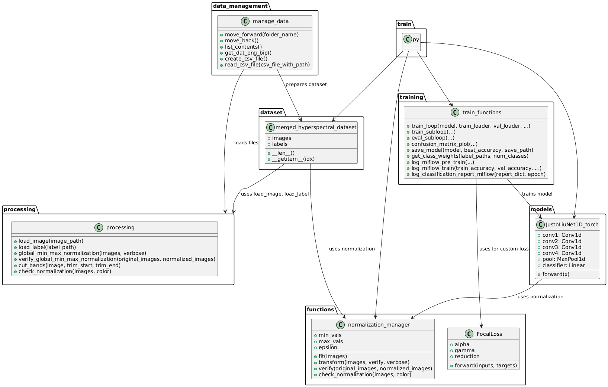
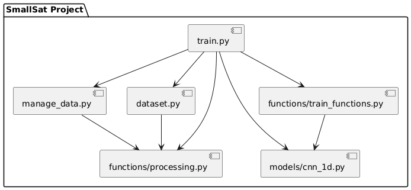
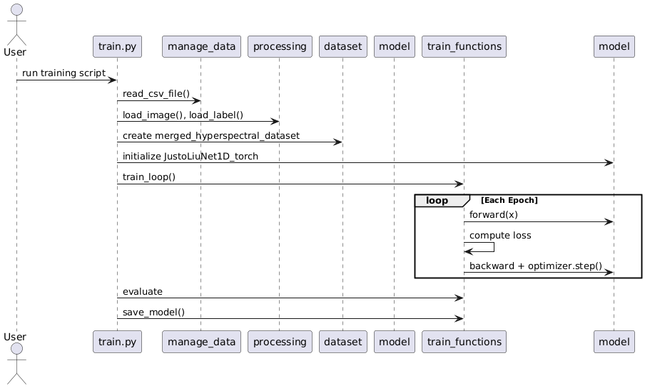
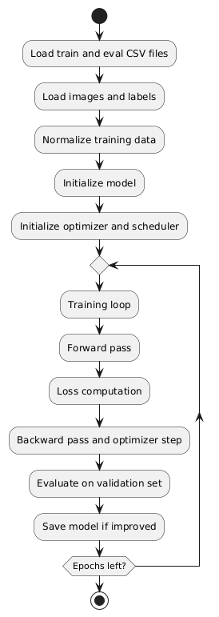

# 1D CNN for Sea/Land/Cloud Classification of Hyperspectral Images from the HYPSO-2 Satellite

This project implements the 1D-JustoLiuNet for classification tasks on hyperspectral satellite image captures from the HYPSO-2 satellite.
The 1D-JustoLiuNet model is based on recent work by Justo et al. (2023) and optimized for deployment in resource-constrained satellite environments.

Full theoretical background, model design, evaluation metrics, and experimental results are presented in the accompanying [final report PDF](readme_files/Final_Report_1D-JustoLiuNet_HYPSO-2.pdf), submitted as part of an academic research contribution at NTNU SmallSat Lab.

## Table of Contents

- [Requirements](#requirements)
- [Usage](#usage)
- [Structure](#structure)
- [Theory, Testing and Results](#theory-testing-and-results)
- [License](#license)
- [References](#references)
- [Acknowledgments](#acknowledgments)


## Requirements

- CUDA version: 12.6
- UBUNTU version: 22.04
- NVIDIA driver version: 565.57.01

## Usage

1. Clone the repository:

    ```bash
    git clone https://github.com/raeesiarya/HYPSO-CNN.git
    ```

2. Install required packages:
    ```bash
    pip3 install -r requirements.txt
    ```   

This project used Python 3.12.3 in a virtual `venv` environment.

3. Prepare your dataset:
    1. Get the raw data from HYPSO-2:
        ```bash
        python3 scraping/get_data1.py
        ```
    2. Run the function `create_csv_file` in `manage_data.py` to create CSV files with correct paths.

4. Train and evaluate the model:

    ```bash
    python3 scripts/train.py
    ```

## Structure

1. Class Diagram (shortened, full version in page 50 [here](readme_files/Final_Report_1D-JustoLiuNet_HYPSO-2.pdf))



*Figure 1: Class diagram of the 1D-CNN classification pipeline.*

2. Component Diagram



*Figure 2: Component of the 1D-CNN classification pipeline.*

3. Sequence Diagram



*Figure 3: Sequence diagram of the 1D-CNN classification pipeline.*

4. Activity Diagram



*Figure 4: Activity diagram of the 1D-CNN classification pipeline.*

## Theory, Testing and Results

All theory, testing and results have been presented in [this PDF](readme_files/Final_Report_1D-JustoLiuNet_HYPSO-2.pdf).

## License

This project is licensed under the MIT License. See the [LICENSE](LICENSE) file for details.

## References

- Jon Alvarez Justo, Dennis D. Langer, Simen Berg, Jens Nieke, Radu Tudor Ionescu, Per Gunnar Kjeldsberg, and Tor Arne Johansen.  
  *Hyperspectral Image Segmentation for Optimal Satellite Operations: In-Orbit Deployment of 1D-CNN*.  
  **Remote Sensing**, vol. 17, no. 4, p. 642, 2025. [DOI: 10.3390/rs17040642](https://doi.org/10.3390/rs17040642)

- Jon A. Justo, Joseph Garrett, Dennis D. Langer, Marie B. Henriksen, Radu T. Ionescu, and Tor A. Johansen.  
  *An Open Hyperspectral Dataset with Sea-Land-Cloud Ground-Truth from the Hypso-1 Satellite*.  
  In *2023 13th Workshop on Hyperspectral Imaging and Signal Processing: Evolution in Remote Sensing (WHISPERS)*, IEEE, pp. 1–5, 2023.

- Jon Alvarez Justo, Joseph Landon Garrett, Mariana-Iuliana Georgescu, Jesus Gonzalez-Llorente, Radu Tudor Ionescu, and Tor Arne Johansen.  
  *Sea-Land-Cloud Segmentation in Satellite Hyperspectral Imagery by Deep Learning*.  
  arXiv preprint arXiv:2310.16210, 2023. [arXiv:2310.16210](https://arxiv.org/abs/2310.16210)

- Ian Goodfellow, Yoshua Bengio, and Aaron Courville.  
  *Deep Learning*. MIT Press, 2016. [Online version](https://www.deeplearningbook.org/)

## Acknowledgments

This project was developed as part of my work with the NTNU SmallSat Lab. I would like to thank the entire SmallSat team for their collaboration and support throughout the project.
